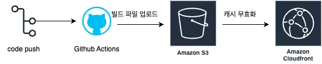

This is a [Next.js](https://nextjs.org) project bootstrapped with [`create-next-app`](https://nextjs.org/docs/app/api-reference/cli/create-next-app).

## Getting Started

First, run the development server:

```bash
npm run dev
# or
yarn dev
# or
pnpm dev
# or
bun dev
```

Open [http://localhost:3000](http://localhost:3000) with your browser to see the result.

You can start editing the page by modifying `app/page.tsx`. The page auto-updates as you edit the file.

This project uses [`next/font`](https://nextjs.org/docs/app/building-your-application/optimizing/fonts) to automatically optimize and load [Geist](https://vercel.com/font), a new font family for Vercel.

## 배포 파이프라인



1. Checkout 액션을 사용해 코드 내려받기
2. `npm ci` 명령어로 프로젝트 의존성 설치
3. `npm run build` 명령어로 Next.js 프로젝트 빌드
4. AWS 자격 증명 구성
5. 빌드된 파일을 S3 버킷에 동기화
6. CloudFront 캐시 무효화

## 주요링크

- S3 버킷 웹사이트 엔드포인트: http://hanghea99.s3-website.ap-northeast-2.amazonaws.com/
- CloudFrount 배포 도메인 이름: https://d1dxxe35ykrggl.cloudfront.net/

## 주요 개념

- GitHub Actions과 CI/CD 도구: GitHub Actions는 GitHub에서 제공하는 자동화된 워크플로우 도구입니다. CI(지속적 통합)와 CD(지속적 배포)를 구현할 수 있게 해주는 도구입니다. 개발자가 코드를 main 브랜치에 push하면 자동으로 테스트, 빌드, 배포 과정이 실행되도록 설정 할 수 있습니다.
- S3와 스토리지: Amazon S3(Simple Storage Service)는 AWS에서 제공하는 클라우드 스토리지 서비스입니다. 정적 웹사이트 호스팅에 사용될 수 있습니다.
- CloudFront와 CDN: Amazon CloudFront는 AWS의 CDN(Content Delivery Network) 서비스입니다. 전 세계 엣지 로케이션을 통해 콘텐츠를 빠르게 전송합니다:

  - 작동 방식
    1. 사용자가 웹사이트에 접속 요청
    2. DNS가 가장 가까운 엣지 로케이션으로 라우팅
    3. 엣지 로케이션에서 캐시 확인:
       - 캐시 있음 → 즉시 콘텐츠 제공
       - 캐시 없음 → 오리진에서 콘텐츠 가져와 캐싱 후 제공

- 캐시 무효화(Cache Invalidation): CloudFront의 캐시 무효화는 CDN의 캐시된 콘텐츠를 강제로 업데이트하는 프로세스입니다. 이를 통해서 배포 시 캐시를 무효화 시켜서 최신 콘텐츠를 사용자에게 제공할 수 있습니다.
- Repository secret과 환경변수: GitHub Repository에서 민감한 정보를 안전하게 관리하는 방법입니다.
  - GitHub Actions 워크플로우에서 안전하게 사용 가능
  - 권한 있는 사용자만 접근 가능
  - 버전 관리에서 제외되어 보안 유지
